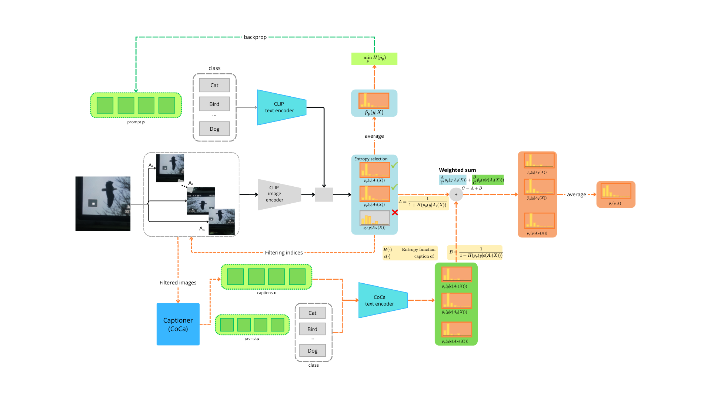

# Test-time Adaptation for few-shots classification using CLIP



## DESCRIPTION
The project aims to improve the performance of the zero-shot CLIP model by OpenAI on the ImageNetA and ImageNetV2 datasets. We propose ensemble techniques on CLIP to improve its 0/1-shot capability. The techniques used include TPT ([Test-Time Prompt Tuning](https://github.com/azshue/TPT?tab=readme-ov-file)), CoOp ([Context Optimization](https://github.com/KaiyangZhou/CoOp)), and CoCa ([Contrastive Captioner](https://github.com/mlfoundations/open_clip.git)). On top of that, we propose a new architecture which exploits the captions obtained from CoCa to improve the classification performance of CLIP. This is done by ensembling the logits coming from the standard CLIP model with the logits obtained from the information contained in the captions. The captions are used to filter the images in the batch and the logits are combined using three different approaches: a standard deviation based approach proposed by Yang. et al. [Image-Caption Encoding for Improving Zero-Shot Generalisation](https://arxiv.org/pdf/2402.02662), a harmonic mean of the logits (ours) and an **entropy-weighted average** of the logits (ours) which achieved a **+2%** improvement in Top-1 accuracy.

## Project setup
In order to be able to run the project you need to have the following libraries installed and the following directories created:

```bash
pip install open_clip_torch gdown matplotlib transformers tensorboard
pip install git+https://github.com/openai/CLIP.git
mkdir caption_reports batch_predictions batch_reports runs
```

Then you need to download the weights of CoOp which can be easily installed by following the snippet of code provided in the Project setup section of the notebook.

## Dataset

The dataset used for the project is the ImageNetA and ImageNetV2 datasets. These imagenet variants are the most used when testing adaption of a model.

Please refer to the dataset section of the project notebook to have a simple script to download the datasets.

## Usage
The main script is `tpt_eval.py` which can be run with the following arguments:

```bash
python tpt_eval.py --backbone ViT-B/16 --dataset ImageNetV2 --method entropy-avg --ice_loss --run_name imagenetV2/entropy-avg
```
In this example we are running the script with the ViT-B/16 backbone on the ImageNetV2 dataset using the entropy-avg method. The ice_loss flag is used to enable the ICE loss which is a loss function that enables the ensembling of the logits. The run_name is used to save the logs of the run in the `runs` directory.


## See Also

* [OpenCLIP](https://github.com/mlfoundations/open_clip): includes larger and independently trained CLIP models up to ViT-G/14
* [Hugging Face implementation of CLIP](https://huggingface.co/docs/transformers/model_doc/clip): for easier integration with the HF ecosystem
